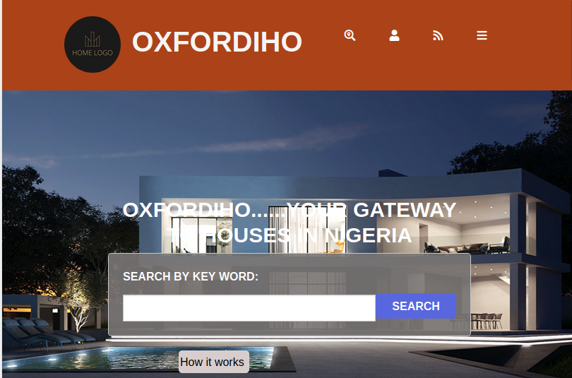

# New-York-Times-Webpage-Clone

# Html-css-capstone-project

> This is my Directory Of Houses website.
- Embedding image
- Floats and positioning
- The box model
- flex box
- grid

Additional description about the project and its features.

## Livelink

- [CLICK HERE](https://oxford-g.github.io/HTML-CSS-CAPSTONE-PROJECT/index.html)

## Built With

- HTML
- CSS

## Getting Started

**This is an example of how you may give instructions on setting up your project locally.**
**Modify this file to match your project, remove sections that don't apply. For example: delete the testing section if the currect project doesn't require testing.**

To get a local copy up and running follow these simple example steps.

- On the project GitHub page, navigate to the main page of the repository [this page](https://oxford-g.github.io/NYT-webpage-clone/).
- Under the repository name, locate and click on a green button named `Code`.
- Copy the project URL as displayed.
- If you're running Windows Operating System, open your command prompt. On Linux, Open your terminal.
- Change the current working directory to the location where you want the cloned directory to be made. Leave as it is if the current location is where you want the project to be.
- Type `git clone`, and then paste the URL you copied in Step 3. 
  `$ git clone https://github.com/oxford-g/NYT-webpage-clone.git` <em>Press Enter key</em> 
- Press Enter. Your local copy will be created.

Please Note that you must have github installed on your PC, this can be done [here](https://gist.github.com/derhuerst/1b15ff4652a867391f03).

### Prerequisites

Web browser (Chrome/Firefox)

## Author

👤 **ENEKWECHI CHINONSO GERALD**

- GitHub: [@OXFORD-G](https://github.com/OXFORD-G)
- Twitter: [@OXFORD2](https://twitter.com/OXFORD2)

## 🤝 Contributing

Contributions, issues, and feature requests are welcome!

Feel free to check the [issues page](https://github.com/Oxford-G/HTML-CSS-CAPSTONE-PROJECT/issues).

## Show your support

Give a ⭐️ if you like this project!

## Acknowledgments

- [Microverse](https://www.microverse.org/)
- [Patashule](https://www.patashule.com)
- Design idea by Kevin Mutua, Mathew Njuguna and Sam Achola 

## 📝 License

This project is [MIT](lic.url) licensed.

